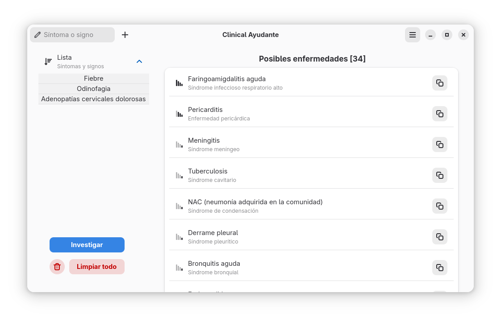
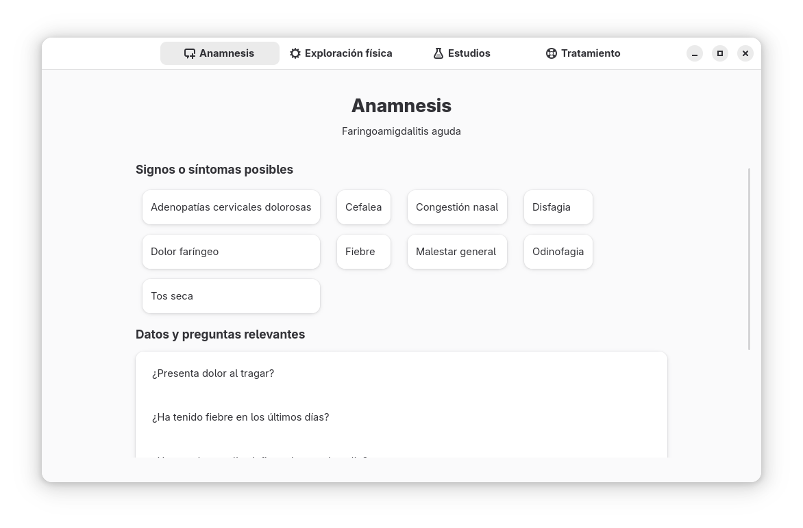
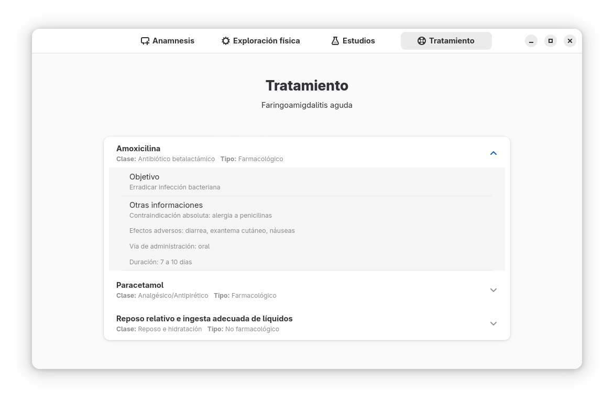

# Clinical Ayudante

### Asistente de diagnóstico clínico para GNOME

**Clinical Ayudante** es una aplicación de escritorio diseñada para el entorno **GNOME** que asiste a profesionales de la salud en el proceso de diagnóstico. Al ingresar una lista de síntomas y signos clínicos, la aplicación los procesa para generar una lista de posibles enfermedades, priorizadas por orden de mayor a menor probabilidad.

Construida con **Python**, **GTK4** y **SQLite3**, combina una interfaz nativa y elegante con un motor de diagnóstico interno.

---

## Características

* **Diagnóstico Priorizado:** Genera una lista de enfermedades potenciales, ordenadas por probabilidad según los síntomas ingresados.
* **Interfaz Intuitiva:** Ofrece una experiencia de usuario fluida y limpia, diseñada para integrarse perfectamente con el entorno de escritorio GNOME.
* **Tecnología Robusta:** Desarrollada con Python, GTK4 y una base de datos SQLite3 para un rendimiento eficiente y fiable.

---

## Instalación desde Flatpak

### 1. Añadir el repositorio

Para añadir el repositorio de la aplicación **Clinical Ayudante**, abre una terminal y ejecuta:

```bash
flatpak remote-add --user --if-not-exists thorhent-CA https://thorhent.github.io/CA/CA.flatpakrepo
```

### 2. Actualizar el repositorio (opcional)

```bash
flatpak update --user thorhent-CA
```

### 3. Instalar la aplicación

```bash
flatpak install thorhent-CA io.github.thorhent.CA
```

### 4. Ejecutar la aplicación

```bash
flatpak run io.github.thorhent.CA
```

### 5. Desinstalar la aplicación (opcional)

```bash
flatpak uninstall io.github.thorhent.CA
flatpak remote-delete thorhent-CA
```

> 💡 **Nota:** La instalación se realiza con la opción `--user`, lo que significa que queda disponible solo para el usuario actual. Si deseas instalarla a nivel del sistema, omite `--user`.

---

## Capturas de pantalla





---

## Estado de la base de datos

El funcionamiento de Clinical Ayudante depende de una base de datos interna con información clínica. Actualmente, esta base de datos está en desarrollo activo y se están añadiendo nuevos datos de forma continua para mejorar la precisión y la amplitud de los diagnósticos.

---

## Contribuciones

¡Nos encantaría recibir tu ayuda! Puedes contribuir al proyecto de varias maneras:

* Reportando errores o sugiriendo nuevas funcionalidades.
* Añadiendo información a la base de datos para hacer el diagnóstico más completo.
* Mejorando el código o la interfaz de usuario.

Si tienes alguna idea, no dudes en abrir una *issue* o enviar un *pull request* en el repositorio de GitHub.

---

## Versión

Versión: 1.2.26

---

## Licencia

Este proyecto está distribuido bajo la licencia [Licencia Apache 2.0](https://www.apache.org/licenses/LICENSE-2.0).

