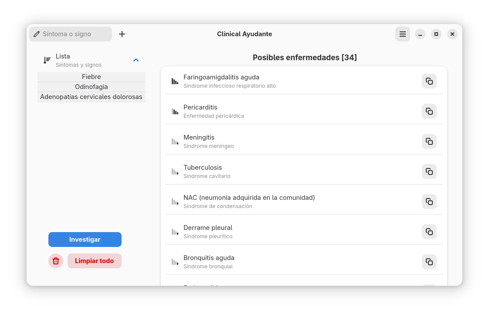
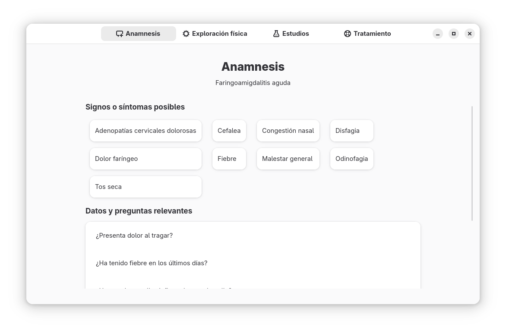
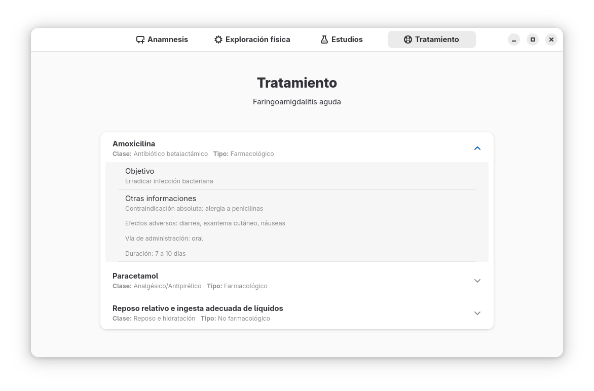

# Clinical ayudante

Aplicación Gnome con python, GTK4 y sqlite3. La aplicación recibe una lista de síntomas o signos 
clínicos como entrada, los procesa y genera una lista de posibles enfermedades en orden 
de mayor para menor probabilidad.

Base de datos en desarrollo.

Versión: 1.8.25

## Instalación 

Dentro del directorio del proyecto:
     
     [1]$ flatpak-builder --user --force-clean --install builddir/ com.github.thorhent.CA.json

     [2]$ flatpak run com.github.thorhent.CA

 

## Screenshots

 

